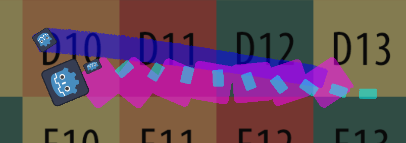

# Godot Trail Toolkit Addon

## Intro
This addon contains a **TrailGenerator** class which extends **CanvasGroup** and facilitates the generation of various trail effects for visual elements like **CanvasGroup**s **Sprite2D**s.

This addon relies on **SnapshotGenerator**. It is provided by the **Godot Snapshot Generator** addon, which was created specifically for this addon.

## Terminology

* **subject*** - a visual element that a **SnapshotGenerator** is set to capture.
* **snapshot*** - a runtime-generated alpha image of all **subjects*** of a **SnapshotGenerator**.

## In This Addon

* **TrailGenerator** class which extends **CanvasGroup** and facilitates the generation of various trail effects for visual elements like **CanvasGroup**s **Sprite2D**s.
* **Default shaders** for **default Materials**.
* **Default Materials** for the different parts of the **TrailGenerator**.
* **Example scene** containing multiple working **TrailGenerators** at the same time.

## Basic Usage

Add a **TrailGenerator** to your scene.

Choose a `target_root` node, can be one of the **subjects*** or a parent node, note that it will be the node considered when using automatic enabling.

Set all the desired **subjects*** to be trailed in `subjects`. Those can be **CanvasGroup**s or individual **Sprite2D**s.

Make sure that each **subject** has a **ShaderMaterial** that supports **SnapshotGenerator**. To do that, you must include the **shader includes** provided by the addon in this fashion:

*image 1: a minimal example of SnapshotGenerator supporting ShaderMaterial code*

Read more about the limitations around this **ShaderMaterial** in the **Snapshot Generator Addon**'s *README*.

Set the desired global rect that you want to take a **snapshot*** of in `snapshot_rect` (it will be relative to `target_root`'s global position if the **SnapshotGenerator** is set to follow it).

Set the desired resolution multiplier of the **snapshots*** in `snapshot_resolution_scale` to your needs. Higher values means higher **snapshot*** quality within the same global `snapshot_rect`.

Set the desired `trail_lifetime` of individual trail particles.

Set `automatic` to choose whether the **TrailGenerator** automatically enables itself when `target_root` moves at a global speed larger than the one defined in `speed_threshold`, or whether **TrailGenerator** is manually enabled using `enabled`.

Choose the desired `trail_type`. **Ghost** would be a trail that generates distinct silhouettes at past positions of the element, and **Stretch** would generate stretched silhouettes that fill in the gaps between themselves.

Choose the desired `spread_mode`. **Distance** would make it so that trails are generated based on the accumulated global travel distance of the element against a distance interval which is configurable with `distance_spread`, and **Time** would generate trails based on a constant interval which is configurable with `time_spread`.

If you chose **Distance** as your `spread_mode`, you also need to choose the minimum amount of **snapshots*** that the **SnapshotGenerator** needs to reserve for you using `reserved_frames`. This is because `target_root` can potentially surpass `distance_spread` every frame, potentially leading to very large past-**snapshots*** storage requirement, thus it's best configured manually.

You can go to the `material` of the **TrailGenerator** and set `shader_parameter/silhouette_color` to whatever you would like. You can also create a new **ShaderMaterial** with a custom **Shader** inspired by the default **ShaderMaterial**.

## Technical Overview

The **TrailGenerator** uses a few elements for its operation.

When starting the application, it creates a **SnapshotGenerator**, a **GPUParticles2D**, and a **Sprite2D**.

The **SnapshotGenerator** is used to generate **snapshots*** of the **TrailGenerator**'s **subjects*** which are used for the trail visuals.

The **GPUParticles2D** node is used to spawn trail particles which would display the **snapshots*** taken by the **SnapshotGenerator**.

The **Sprite2D** is used when `trail_type` is set to **Stretch**, and it sits at the head of the trail just under the **subjects*** so simulate a smoother trail generation, as otherwise the stretched trail will spawn in discrete sections just before the **subjects***.

When `trail_type` is set to **Ghost** and `spread_mode` is set to **Distance**, upon teleportation of `target_root` the **TrailGenerator** would place multiple trail ghosts at constant intervals along the teleportation path, based on `distance_spread`.

There are a few notable techniques I am using in **TrailGenerator**:

* I am using a custom **ShaderMaterial** for the trail particles, which lets you define a stretch `offset`, and it would stretch those particles in global space for you.

* I am using a custom **ShaderMaterial** as the **GpuParticle2D**'s `process_material`, which utilizes the **CUSTOM** built-in variable differently than by default. First, I am using it's z as usual, and its the animation frame on the particle. This in turn coincides with the **SnapshotGenerator**'s texture atlas, and I set it to the return value of **SnapshotGenerator**.`generate_snapshot()` for every particle that I spawn. However, I am repurposing the x and w channels to be the x and y of the stretch `offset` for the particles of a **Stretch** trail type, so that they can stretch in unique directions between them.

* I am using a `_leading_sprite`, which is a **Sprite2D** with the same shader material as the particle shader material, and it stretches between the **subject*** and the last generated trail particle every frame, to give the illusion of a seamless trail generation.

* **GPUParticles2D**.`emit_particle()` has been especially rowdy, sometimes spawning particles with a delay of more than a whole frame. This lead to me also adding a redundancy `_second_leading_sprite` **Sprite2D** which would be immediately placed where the latest particle had just been set to spawn to improve seamlessness. It is a very elaborate solution that introduced some otherwise unnecessary complexity but it is worth it for a smooth trail generation.

## Limitations

Most limitations originate from **SnapshotGenerator**, so please refer to the *README* in its addon folder.
